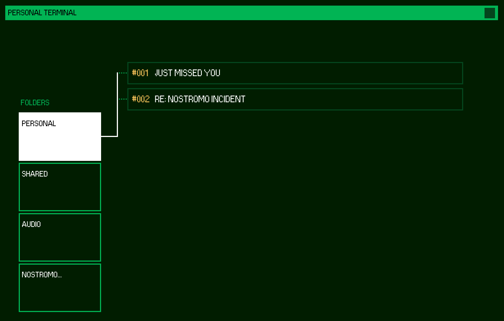

# sevastolink
A web version of the sevastolink terminal from the horror game Alien Isolation.

# 📦 install
copy repo

install node.js (https://nodejs.org/en/download/current)

```sh
    $ cd /path/to/sevastolink 
```

```sh
    $ npm install 
```


# 🏁 use
```sh
    $ node src/server.js
```

